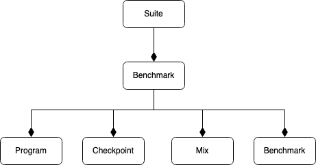

# Running SPEC 17 Benchmarks with Scarab

## Preparing the benchmarks
1. Build SPEC benchmark
Use the `runcpu` utility in SPEC to build and run the benchmark(s) of your interest. Note the build need to be static. If modify from a vanilla SPEC config file, modify the compiler flags as below: 
```
CC                      = $(SPECLANG)gcc     -std=c99 -static  %{model}
CXX                     = $(SPECLANG)g++        -static        %{model}
FC                      = $(SPECLANG)gfortran   -static        %{model}
```

The spec can be built and run from any machine, not necessarily the one where scarab is going to run. Copy the whole spec directory to the machine where scarab will be running. 


2. Run `prepare_spec_checkpoints_directory.py`

The script `<SCARAB INSTALL DIR>/bin/checkpoint/prepare_spec_checkpoints_directory.py` is a helper script to copy the SPEC files used by scarab. Run this script as:
```
python3 bin/checkpoint/prepare_spec_checkpoints_directory.py --spec17_path SPEC_DIR -c CONFIG_NAME --inputs <ref/test/train> --suite spec17_rate -o <OUTPUT DIR>
```
`SPEC_DIR` is the directory of the SPEC benchmarks. `--inputs` should be one of ref/test/train, depends on which dataset is used when running the spec.  The `-c` option refers to the config prefix name when building the spec, something like `mytest-m64.0000`, internally it is use to form the path name and find the run dirs of SPEC benchmarks. 

If this step runs successfully, a file called `program_descriptor.def` will appear under the specified output directory. It defines a bunch of python objects representing the benchmarks just got copied. More on this later. 

3. Build the checkpoint related utilities

Descend to `<SCARAB_INSTALL_DIR>/utils/checkpoint`, there are two directories called `creator` and `loader`, enter each of them and run make. Note Werrors may appear if using gcc > 7.3. You can temporily disable this by modifying the flags defined in `$PIN_ROOT/source/tools/Config/makefile.unix.config:TOOL_CXXFLAGS_NOOPT`

4. Generate Checkpoints

*Note the simpoint tools require python2, make sure it's installed in the environment*

Run the script `<SCARAB_INSTALL_DIR>/bin/checkpoint/create_checkpoint.py` to generate the checkpoints for the SPEC benchmark just created. A sample cmd looks like this:
```
python3 <SCARAB_INSTALL_DIR>/bin/checkpoint/create_checkpoint.py -d OUTPUT_DIR/program_descriptor.def -n <NUM OF THREAD TO GENERATE CKPTS> --max-num_simpoints <NUM_MAX_SIMPTS> --simpoint_length <BBL_LENGTH> -o OUTPUT_DIR -f
```
Internally this script will do 3 things: 1) call the simpoint tools to figure out the instruction offsets and weights of the simpoints to each SPEC benchmark 2) run the benchmarks and dump checkpoints at each simpoint. 3) generate a descriptor file. Each step can be run independently given the correct cmdline option (see the cmdline help for details). By default, all 3 steps are run and the process will take couple hours to finish. 

If the script finishes correctly, you will see a file named `descriptor.def` under the output path. Note this def file contains the absolute paths of the benchmarks and checkpoints. So once generated, all benchmarks and checkpoints files should not be moved.


## Using the benchmarks
Internally, scarab represents the workloads as python objects, and these objects are organized in a hierarchy of object, as shown in the figure:



The bottom 3 classes (`Program`, `Checkpoint` and `Mix`) represent concrete workloads while the `Benchmark` and `Suite` are wrapper for the basic types. The `Program` class represents the workloads which runs from beginning to the end. The `Checkpoint` class represents a single checkpoint from a program. And `Mix` class represent a mix of `Program` or `Checkpoint`, and is used for multiprogrammed workloads. 

The `program_descriptor.def` generated by running the `prepare_spec_checkpoints_directory.py` is a python script snippet which contains the objects definition representing the spec17 benchmarks. The `descriptor.def` is a code snippet for defining the checkpoint objects. The `.def` file is meant to be included in the scarab runfile, and then in the runfile you can either directly use these workload objects or make multiprogrammed mixes with them. 